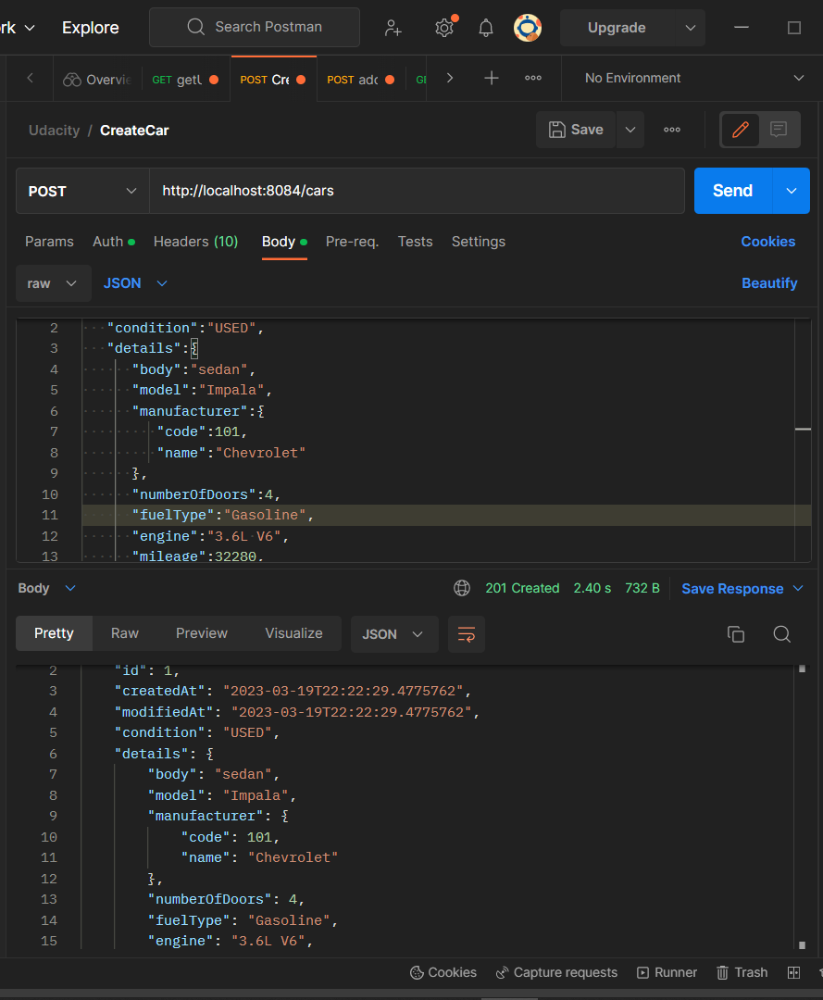
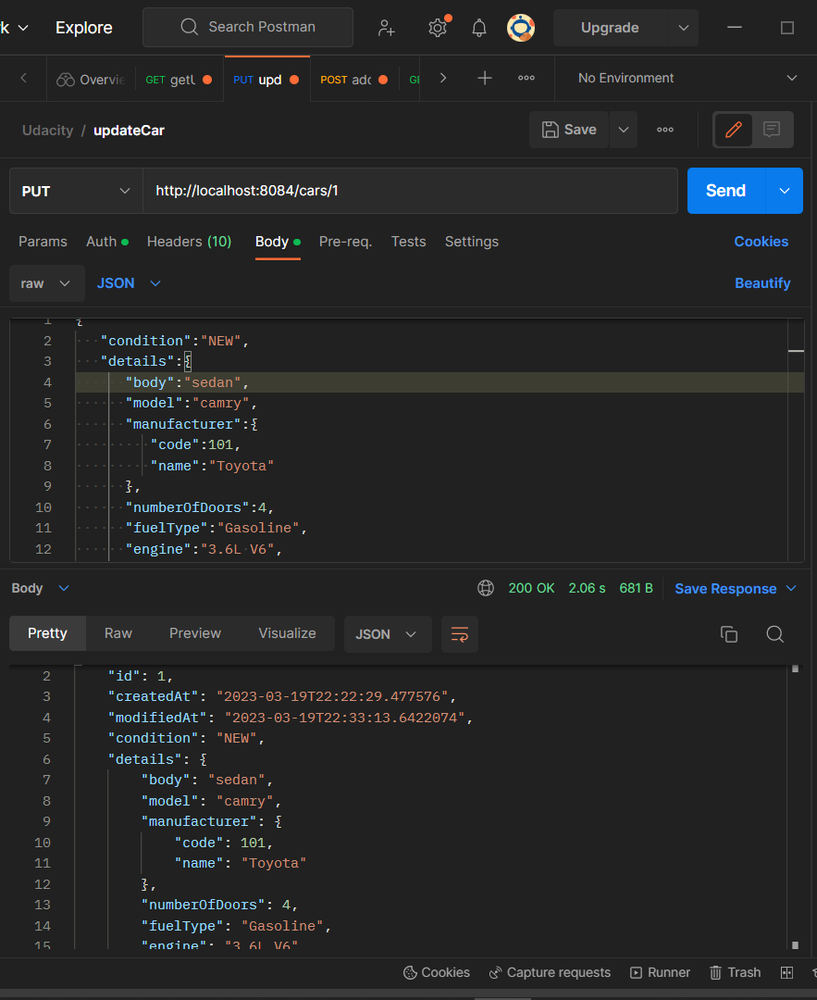
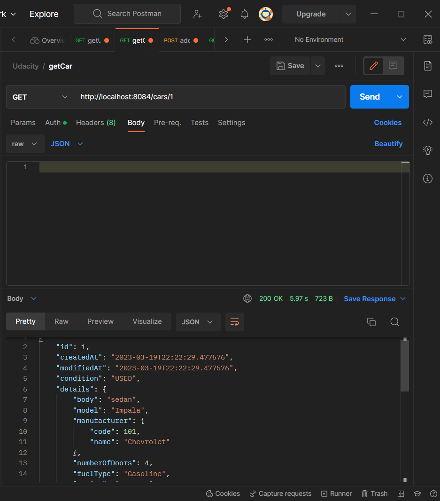
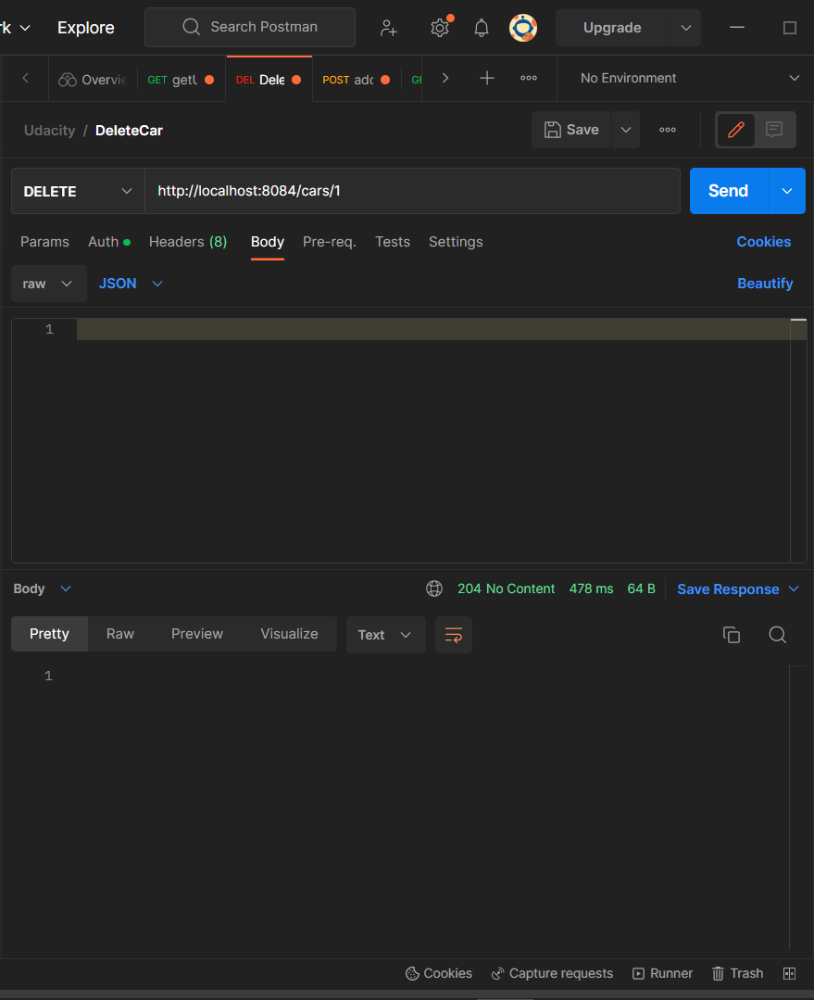
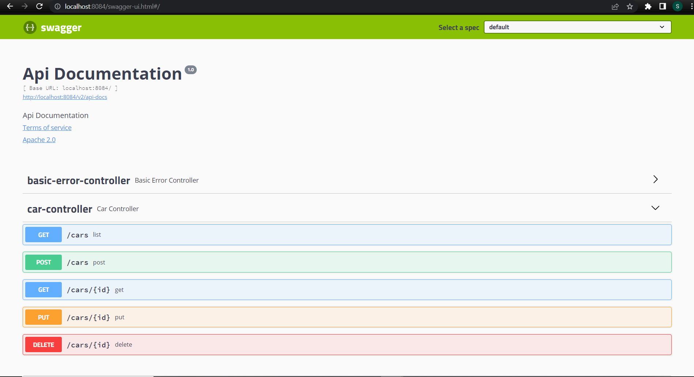

# ND035-P02-VehiclesAPI-Project

Project repository for JavaND Project 2, where students implement a Vehicles API using Java and Spring Boot that can communicate with separate location and pricing services.

## Instructions

Check each component to see its details and instructions. Note that all three applications
should be running at once for full operation. Further instructions are available in the classroom.

- [Vehicles API](vehicles-api/README.md)
- [Pricing Service](pricing-service/README.md)
- [Boogle Maps](boogle-maps/README.md)

## Dependencies

The project requires the use of Maven and Spring Boot, along with Java v11.

## Screenshots

Click here to show the screenshots of project

  
 
 CreateCar 

 
 
 UpdateCar 

 
 
 GetCar 

 
  
 DeleteCar 

 
  
 Pricing-service tests 

 
  
 VehicleAPI tests 

 
  
 Swagger 

 

